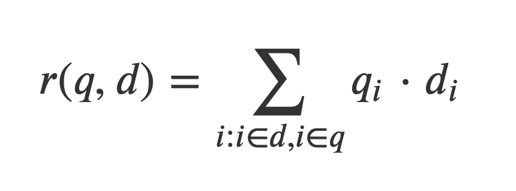
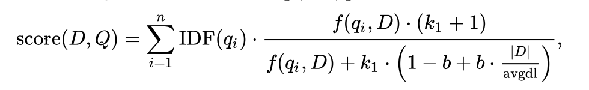
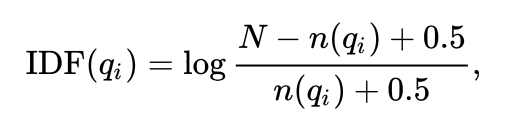

# Assignment 1

- [Assignment 1](#assignment-1)
  - [Github Repository](#github-repository)
  - [Team:](#team)
  - [Intro](#intro)
  - [Components](#components)
    - [Indexer](#indexer)
    - [Ranker](#ranker)
      - [Naive](#naive)
      - [BM25](#bm25)
  - [Problems](#problems)
  - [Performance](#performance)
    - [Future improvements](#future-improvements)
  - [Results](#results)
  - [Contribution](#contribution)

---

## [Github Repository](https://github.com/lozhn/BDTA-F19-Assignment-1) 

## Team: 
- Arseniy Poyezzshayev (a.poezzhaev@innopolis.ru) ([@arseniy_p](tele.click/arseniy_p))
- Nikita Lozhnkov (n.lozhnikov@innopolis.ru) ([@palpatine](tele.click/palpatine))
- Sergei Bakaleinik (s.bakaleinik@innopolis.university) ([@BSergey_jr](tele.click/BSergey_jr))

<sup>(in alphabetical order)</sup>

## Intro

In this homework, we are implementing a simple search engine with Spark. It supports indexing and document search. The goal is to practice programming with Spark, and search complexity is not a primary measure of performance. We implemented document indexing using RDD, the ranger used two methods: Basic Vector Space Model (Naive) and BM25.

## Components 

The source code files are located at `src/main/scala`

- **Indexer** (`Indexer.scala`) - the Indexer class that operates upon `CompactIndex` class
    - **CompactIndex** (`CompactIndex.scala`) - the CompactIndex class and object
- **Ranker** (`Ranker.scala`) - the Ranker class that provides _Naive_ and _BM25_ ranking algorithms
- **implicits** (`implicits.scala`) - implicit methods on _String_, i.e. `.tokenize()` and `sanitizeTrimLower` to provide uniform string processing capabilites on top of the _String_ class

### Indexer

```bash
$ spark-submit --class Indexer app.jar <input-path> <index-path> <cmd> [<old-index>]

# <input-path> - a path to the documents to be indexed
# <index-path> - a path where the index will be stored
# <cmd> - build|add  
#           - build 
#              it will build an index on the files located ad <input-path>. <old-index> is not needed. 
#               
#           - add
#               it will load index from <old-path>, add documents from <input-path> and save the updated index to <index-path>
#               
```

Example 

```bash
$ spark-submit --class Indexer app.jar hdfs:///EnWikiMedium hdfs:///egypt/indexMedium build
```

**Indexer architecture**

We decided to use RDDs as a main data structure for our computations because it is quite low-level and without any SQL-like optimizations etc. This allowed us to feel the pain to investigate the issues connected with data flows. The initially proposed RDD of 3-Tuples `(doc, word, frequency)` is too redundant. We created the `CompactIndex` class which contained two internal indexes. One is a map of `Words: {word: Set(docs)}` another is nested map of `Docs: {doc: {word: TF}}`. These internal indices allowed us to effectively calculate _TF_, _IDF_, _avgdl_, _|D|_ which are enough for both rankers. 

The main architectural decision was to support the adding of new documents to index on-fly. Therefore, we decide not to add the precomputed IDFs to words index, because we must recompute IDFs with every added document. Also, we assumed that the addition of duplicated documents is possible, therefore we keep the Sets of documents in which the certain word is occurred (not only number of documents). We created the method for appending the newly added documents to existing index.


### Ranker

Is an object class with `main` method.

```bash
$ spark-submit --class Ranker app.jar <input> <method> <query>

# <input> - path for loading index
# <method> - naive(based on vector dot product) or bm25
# <query> - query to find relevant document
```

Example

```bash
$ spark-submit --class Ranker app.jar hdfs:///egypt/indexMedium naive "hello world"
```

#### Naive

In the beginning we didn't have enough time to learn Scala/Spark in depth. So we used RDDs to represent index, word frequency, etc.
Another problem the division by zero so we had add smoothing for TF/IDF processing of a query on the fly.

In the basic vector space model, both documents and queries are represented with corresponding vectors, which capture TF/IDF weights of a document and the query.

The simplest way to convert TF/IDF weights to a vector interpreted by a computer is to index the array with word Ids and record TF/IDF value.
The function that determines the relevance of a document to a query is the inner product (scalar product) of the two vectors: document `d` and given query `q`.

 

where **q<sub>i</sub>** is the TF/IDF weight of the i-th term in the query. We compute rank over the interscetion of term frequencies of a document and query term frequencies which is faster than the full union.

#### BM25 

[BM25](https://en.wikipedia.org/wiki/Okapi_BM25) is on the most popular and widely used ranking alogirthms that is used to calculate a rank of document `D` given query `Q`



We used default values for k<sub>1</sub> and b. **k<sub>1</sub>** = 2.0 and **b** = 0.75

**f(q<sub>i</sub>, D)** is taken from the precomputed Index - it is an `RDD[String1, HashMap[String2, Int]]` where `String1` - Document title, `String2` - Word, `Int` - frequency of the Word in the Doc.

The **D** and **avgdl** values are precomputer before a ranker is started and since these values are constant, in our context, we broadcasted them to use inside of the transformation steps using `Index.docs`

**IDF(q<sub>i</sub>)** is also a precomputed value, given the query, we created and broadcasted a HashMap in order get a constant time access in the transformation steps.

This is the formula we used to calcuate **IDF** (smoothed IDF)



Where **N** is the total number of documents (**D** mentioned above), **n(q<sub>i</sub>)** is the number of documents that contain **q<sub>i</sub>**. These values are stored in `Index.words`

The ranking flow is the following:

- Collect IDFs for the query terms - `idfs` (the common step for both naive and bm25)
- Map through all of the documents
    - Given the Doc and the related Term Frequency Map (word => frequence) 
        - Iterate over the `idfs` and compute the BM25 score
- At this point we have an RDD of (Rank, Doc)
    - Apply `.sortByKey(ascending = false)` (the key is Rank)
- Take 10 first elements with the highest rank


## Problems

Precomputation of IDFs as well as TF/IDF for every term in every document may help both rankers. This computation may be performed on the immutable index and we added the method for it in CompactIndex class. We don’t serialize the precomputed TF/IDFs in files and must process it every time the index is loaded into memory. This means that our Rankers could exploit improved performance only if the Indexer program is loaded in memory (daemon process). However, according to the task we cannot use daemons to not occupy resources of the cluster. Every query ranking starts from loading dumped index and then ranking task. This is a drawback of our solution.

We faced the problem of RDDs serialization in objectFile, because there is no native support for every Scala collection in RDD serialization. Therefore, we created custom save and load methods in CompactIIndex, which internally saves and loads two separate RDDs (Words and Docs).

## Performance

Indexing operation is quite performant: 

* It **indexes** the whole dataset (EnWikiMedium) in about **6 minutes** on cluster. 
* **Loading** operation takes about **6 seconds**.
* **Appending** new docs takes about **1 minute** (not including building time) for new docs dataset of size comparable to EnWikiMedium.

### Future improvements

- **D** and **avdgl** can be precomputed and stored in the index
- Rank only the documents that do contain the query terms
- Increase parallelization factor to partion the presorted `Index.docs` to allow parallel scan


## Results

Ranking is not that performant as we would like it to be:

* Naive ranker is usually 1.5 times faster than BM25, because our implementation of BM25 needs to do more O(n) operations like `.count()` and filtering was not the most efficient due to fullscan of the docs. Next time we won't use RDDs and fullscan
* BM25 showed better berformance is average but we assume that the more trustworthy result will be obtained on a more carefully parsed and preprocess data (e.g. some articles were not complete, tokens were not stemmed etc. <- this is the future work)

```
Query : "inhabited by numerous tribal nations prior to the landing in 1500 of explorer Pedro Álvares Cabral"

Naive: AP=0.30                 BM25: AP=0.25
 History of Austria              Explorer (disambiguation)               
 History of Australia            1500s (decade)                 
 History of the Netherlands      [Rank < 0.001]                       
 History of France                 740s             
 History of Poland                 Ananke             
 History of Guatemala              1962               
 Jean Chrétien                     1809        
                                   1584
                                   December 30
                                   390s BC                                    
                                   September 23

-----------------------------------------------------------------------

Query: "Hello world"

Naive: AP=0.00                   BM25: AP=0.33                            
 FIFA World Cup                    Hello Kitty                           
 Russia                            "Hello, World" program                   
 China                             Poe (singer)                  
 World music                       Carmen Miranda                       
 Economy of the United States      (Open Shortest Path First)
 Greyhawk                          Todd Rundgren                     
 Cricket World Cup                 Java (programming language)                           
 
```

## Contribution

- Arseniy Poyezzshayev 
  - Indexer
  - Report
  - Optimizations
- Nikita Lozhnkov 
  - BM25 Ranker
  - Report
  - Cluster interaction
- Sergey Bakaleynik 
  - Naive Ranker
  - Report
